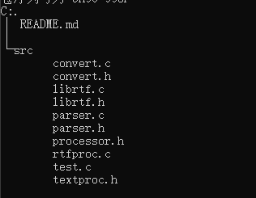

# rtf2txt
C++ sample based on librtf to extract txt from rtf
# structure

test.c main program to extract txt from rtf

others source code of librtf

# compile
gcc -o test test.c convert.c librtf.c parser.c rtfproc.c

# run
./test